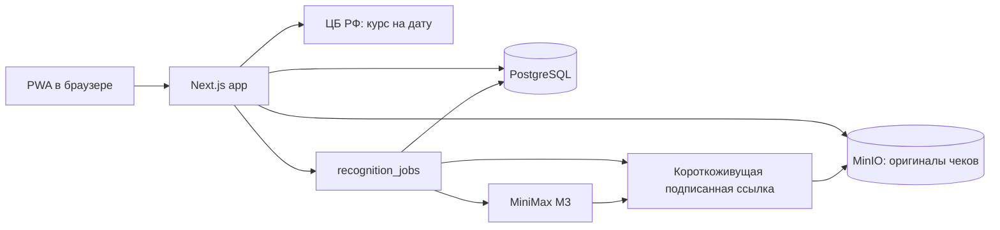

# Командировки — архитектура и передача разработки

> Статус документа: 18 сентября 2026 года.  
> Базовая ревизия: `28863b2` (`fix: recover and retry receipt recognition`).  
> Это рабочий контекст проекта для следующего разработчика или агента. Он отражает решения, принятые с владельцем продукта. Не содержит паролей, API-ключей, токенов, персональных логинов или иных секретов.

## 1. Назначение продукта и зафиксированные требования

Это PWA для ведения расходов в командировках. Пользователи создают командировки, добавляют чеки и расходы, а руководитель контролирует целевой бюджет и факт.

Ключевые договорённости с владельцем продукта:

- Данные участников и оригиналы файлов должны храниться на сервере в РФ.
- Для каждого расхода обязателен чек, скриншот или иной файл-подтверждение. Нельзя сохранить «новый расход» без файла.
- Есть два способа внести расход:
  1. **«Подгрузить чек»** — отправить изображение в MiniMax для заполнения черновика.
  2. **«Добавить расход»** — приложить файл и заполнить те же поля вручную; ИИ в этом сценарии не вызывается.
- «Статья расходов» — это **справочник категорий** (например, Питание, Проживание), а не действие добавления нового расхода.
- Администратор/руководитель может добавлять категории; новые категории должны автоматически появляться в целевом бюджете и в формах расходов/чеков.
- В реестре «Чеки» должны быть все загруженные файлы, включая файлы из ручного сценария. Нужны просмотр, сортировка по дате операции или добавления, фильтр по исходной валюте, замена и удаление автором загрузки или администратором.
- В разделе чека показываются файл и не редактируемая сводка. Для владельца/админа доступна иконка карандаша и отдельный экран редактирования связанного расхода.
- Для китайских чеков нужны оригинальное китайское название/получатель и русская версия; для русских — те же поля с RUB по умолчанию. Валюта редактируема; курс ЦБ РФ можно запросить на дату оплаты или ввести вручную.
- Поле «Название» — первое в форме: для билетов ИИ должен извлекать маршрут «Откуда — Куда», для обычной покупки оно остаётся пустым.
- Нужны мобильный интерфейс, главная с двумя центральными действиями, «Дашборд руководителя» с план/факт и круговой диаграммой расходов по категориям.
- Администратор может удалить командировку. Создавать других администраторов может только определённая админ-учётная запись, заданная через `ADMIN_MANAGER_EMAIL`; значение не должно попадать в документацию, git или клиентский код.

Улучшения, которые не подтверждены владельцем, не следует выдавать за согласованные требования.

## 2. Технологии и компоненты

| Слой | Реализация |
| --- | --- |
| Web/PWA | Next.js 16, React 19, TypeScript, App Router, server components/actions |
| UI | CSS в `src/app/globals.css`, `lucide-react`; отдельного UI-kit нет |
| БД | PostgreSQL 16 + Drizzle ORM |
| Файлы | MinIO (S3-совместимое хранилище) |
| Распознавание | MiniMax `MiniMax-M3`, отдельный worker `src/worker.ts` |
| Экспорт | `exceljs` (XLSX), `docx` (DOCX) |
| Оркестрация | Docker Compose в `compose.yaml`, Dokploy на Xorek |



### Границы хранения и внешние сервисы

- PostgreSQL и MinIO развёрнуты вместе с приложением на сервере в РФ. Оригинал чека остаётся в закрытом MinIO.
- MiniMax — внешний провайдер: при сценарии ИИ изображение чека временно отдаётся ему для распознавания. Это исключение из требования о хранении в РФ, о котором владелец продукта знает. Для production необходимы правовое основание/уведомление пользователей и HTTPS.
- Запрос курса выполняется сервером к открытому XML-интерфейсу ЦБ РФ. Никаких ключей для него не требуется.

## 3. Структура репозитория

```text
src/
  app/                         # страницы и API routes
    api/receipts/              # загрузка, просмотр, замена, удаление, retry/cancel
    api/recognition-files/     # временная подписанная выдача файла только для MiniMax
    api/exchange-rate/         # курс ЦБ РФ
    api/trips/[tripId]/report/ # XLSX/DOCX
    trips/                     # страницы командировок, бюджета, участников, чеков
    manager-dashboard/         # план/факт и круговая диаграмма
    categories/                # глобальный справочник статей
  components/                  # AppShell, ReceiptUploader, ReceiptList, actions
  lib/
    auth.ts                    # сессии, пароли
    budgets.ts                 # агрегации бюджета
    db/schema.ts               # источник истины схемы Drizzle
    recognition-proxy.ts       # HMAC-ссылки для MiniMax
    reports.ts                 # генерация документов
    storage.ts                 # MinIO
  worker.ts                    # очередь и MiniMax
drizzle/                       # миграции 0000–0003
compose.yaml                   # app, worker, migrate, db, minio
```

## 4. Модель данных

Источник истины: `src/lib/db/schema.ts`; миграции должны применяться штатной командой `pnpm db:migrate` через сервис `migrate`.

Основные сущности:

- `users`, `sessions` — пользователи и серверные сессии.
- `categories` — глобальные категории. Первичные значения: Проживание, Проезд, Питание, Такси, Связь, Прочее.
- `trips`, `trip_members` — командировки и доступ участников.
- `trip_budgets` — плановый бюджет по категории и командировке.
- `receipts` — метаданные каждого загруженного файла и его статус обработки; содержимое лежит в MinIO.
- `expenses` — один расход на один чек (`receipt_id` уникален). Включает `title`, поля названия на русском/языке документа, исходную валюту, курс, сумму в RUB, дату, категорию, способ оплаты и примечание.
- `recognition_jobs` — одна задача MiniMax на чек.

Статусы:

- чек: `UPLOADED`, `PROCESSING`, `READY_FOR_REVIEW`, `FAILED`;
- задача: `PENDING`, `PROCESSING`, `DONE`, `FAILED`;
- расход: `DRAFT`, `SUBMITTED`, `APPROVED`, `REJECTED` (в интерфейсе пока фактически используется черновой поток).

## 5. Права доступа

| Роль | Возможности |
| --- | --- |
| `PARTICIPANT` | доступ только к командировкам, где состоит участником; добавление собственных чеков/расходов |
| `MANAGER` | создание командировок, управление собственными командировками/участниками/бюджетом, справочник категорий, дашборд |
| `ADMIN` | доступ ко всем командировкам, удаление командировки, управление участниками и категориями, редактирование/удаление чужих чеков |

Дополнение: создавать пользователя с ролью `ADMIN` вправе только текущий admin, email которого совпадает с серверной переменной `ADMIN_MANAGER_EMAIL`. Не вводить и не сохранять реальные учётные данные в исходниках, документах, issue и скриншотах.

## 6. Основные пользовательские сценарии

### Создание командировки и бюджет

1. Manager/Admin создаёт командировку: название, направление, даты, цель, ответственный за бюджет, суммы по категориям.
2. Руководитель, admin или назначенный `budgetEditor` меняет бюджет.
3. Дашборд руководителя показывает план/факт по категориям и круговую диаграмму текущих трат по открытым/черновым командировкам.

### Чек с ИИ

1. Пользователь загружает JPG/PNG/WEBP/PDF до 10 МБ на `/trips/[tripId]/receipts/new`.
2. `POST /api/receipts` кладёт оригинал в MinIO, создаёт `receipt`, placeholder `expense` и `recognition_job` (если MiniMax включён).
3. `worker.ts` забирает задачу, временно выдаёт изображение через подписанный route `/api/recognition-files/[receiptId]`, вызывает MiniMax и обновляет расход.
4. После обработки пользователь проверяет/правит поля и сохраняет их через `PUT /api/receipts/[receiptId]`.

PDF хранится и открывается, но текущий MiniMax pipeline распознаёт только изображения. Для PDF интерфейс должен предложить ручное заполнение.

### Ручной расход с обязательным файлом

Страница `/trips/[tripId]/expenses/new` использует `ReceiptUploader` в `mode="manual"`:

1. Сначала обязателен файл чека/скриншота.
2. Файл создаёт `receipt` и `expense` с `source = MANUAL`, но не `recognition_job`.
3. Пользователь вручную заполняет те же поля расходов.
4. Такой файл виден в реестре «Чеки» наравне с ИИ-чеками.

### Реестр чеков и действия

- На странице командировки вместо списка «Расходы» расположен раздел «Чеки».
- По умолчанию сортировка — по дате операции; на клиенте доступны сортировки по дате добавления и фильтр по исходной валюте.
- Детальная страница: `/trips/[tripId]/receipts/[receiptId]`.
- Владелец файла и admin могут заменить или удалить чек; удаление удаляет связанный расход и файл в MinIO.
- Иконка карандаша открывает `/trips/[tripId]/receipts/[receiptId]/edit` для правки расхода, связанного с чеком.

## 7. Распознавание MiniMax: текущая реализация и отладка

### Почему это было изменено

Первый вариант отправлял MiniMax `data:image/...;base64`. Практический запрос к API вернул HTTP 400. MiniMax M3 принимает изображение как `image_url`; также его reasoning может быть отделён от обычного `content`. Поэтому реализация была заменена на URL-флоу и устойчивый JSON-парсинг.

### Как работает сейчас

1. Worker получает задачу атомарно, переводит её в `PROCESSING`.
2. `src/lib/recognition-proxy.ts` создаёт HMAC-подписанный URL на 5 минут. Подпись основана на `MINIMAX_API_KEY`; самого ключа URL не содержит.
3. Публичный route проверяет подпись, срок, id задачи, `PROCESSING` и время запуска, после чего отдаёт **только это изображение** из MinIO.
4. Worker передаёт этот `image_url` в `MiniMax-M3` с `reasoning_split: true`, ограничением `max_completion_tokens` и JSON-инструкцией.
5. Парсер удаляет возможный `<think>…</think>` и извлекает JSON-объект. Ошибка MiniMax сохраняется в `receipts.errorMessage` и `recognition_jobs.errorMessage`.

Важно: в `MINIMAX_API_BASE_URL` должен быть базовый адрес `https://api.minimax.io/v1`, **без** суффикса `/chat/completions`, потому что worker добавляет этот путь сам.

### Отмена и повторный запуск

Route `/api/receipts/[receiptId]/recognition`:

- `DELETE` — отменяет `PENDING`/`PROCESSING`, переводит чек в `READY_FOR_REVIEW` и открывает ручную форму.
- `POST` — доступен спустя 1 минуту после запуска, если чек ещё не был успешно/вручную завершён; возвращает задачу в очередь.

`ReceiptUploader` показывает:

- «Заполнить вручную» во время ожидания/обработки;
- ручную форму при `FAILED`;
- «Перезапустить распознавание» через минуту.

Worker сверяет `recognition_jobs.createdAt` перед финальной записью. Это предотвращает перезапись данных старым worker-процессом после отмены или restart.

### Что проверить руками после передачи

Полный E2E-прогон с реальным пользовательским чеком после перехода на подписанный URL должен выполнить владелец, войдя в приложение:

1. Загрузить PNG/JPG (не PDF).
2. Убедиться, что MiniMax заполнил черновик полями и превью осталось доступно.
3. Проверить «Заполнить вручную» во время обработки.
4. Подождать одну минуту на заведомо зависшей/ошибочной задаче и проверить restart.
5. Проверить, что после ручного сохранения результаты старого распознавания не перетёрли внесённые данные.

## 8. Внешние интеграции

### ЦБ РФ

`GET /api/exchange-rate?currency=...&date=YYYY-MM-DD` получает официальный XML-курс. Для RUB возвращается `1`; для нерабочей даты API показывает фактическую дату опубликованного курса. Кнопка «ЦБ» есть рядом с полем курса.

### Alipay

Не реализована авторизация личного Alipay-аккаунта. Анализ показал, что открытые API Alipay ориентированы на merchant-сценарии/конкретные операции и не дают приложению полный список личных трат сотрудника. Согласованный практический поток — загрузка скриншота/чека Alipay. Возможное будущее улучшение: импорт вручную экспортированной пользователем выписки после получения обезличенного примера её формата.

## 9. Инфраструктура и публикация

### Docker Compose

`compose.yaml` поднимает пять сервисов:

- `app` — Next.js;
- `worker` — распознавание;
- `migrate` — обязательное применение миграций до старта app/worker;
- `db` — PostgreSQL;
- `minio` — S3-хранилище.

Все stateful-данные лежат в named volumes `postgres_data` и `minio_data`. Не использовать `freshVolumes: true` при обычном deploy.

### Переменные окружения

Шаблон: `.env.example`. Реальные значения хранятся только в Dokploy/environment, не в репозитории.

| Группа | Ключи |
| --- | --- |
| PostgreSQL | `POSTGRES_PASSWORD`, `DATABASE_URL` |
| MinIO | `MINIO_ROOT_USER`, `MINIO_ROOT_PASSWORD`, `S3_*` |
| App | `APP_URL`, `SESSION_COOKIE_SECURE`, `ADMIN_MANAGER_EMAIL` |
| MiniMax | `ENABLE_MINIMAX_RECOGNITION`, `MINIMAX_API_KEY`, `MINIMAX_API_BASE_URL`, `MINIMAX_MODEL` |

Временный адрес приложения на момент документа: `http://trip-expense-report-3yodvu-a1fd11-212-113-109-18.sslip.io`.

**Критичный риск:** временный адрес работает по HTTP. При ИИ-распознавании временная ссылка тоже будет HTTP, хотя и подписана. До реальной эксплуатации нужно назначить собственный домен с HTTPS через Traefik и выставить `SESSION_COOKIE_SECURE=true`. Не передавать файлы через HTTP в production.

### Dokploy / Xorek

- Развёртывание идёт из GitHub-репозитория `Palerta91/trip_expense_report`, ветка `main`.
- Dokploy использовался по API, а не через UI. Адрес Dokploy и API-ключ намеренно не записаны здесь; новый исполнитель должен получить их у владельца через защищённый канал.
- Compose ID на текущей инсталляции: `662sp3B_Ko6gpejRWlJ2p`.
- Практический deploy-flow: `git push origin main` → `POST /api/compose.deploy` с `{ composeId, title, description, freshVolumes: false }` → опрос `/api/deployment.allByCompose?composeId=...` до `status: done`.
- Исторически автодеплой был включён, но ручной вызов API оставался надёжнее. После каждого deploy проверять логи и HTTP-ответ приложения.

## 10. Локальная разработка и проверки

Нужны доступные Docker/Compose, отдельные локальные значения переменных и сервисы PostgreSQL + MinIO. Не копировать production-секреты в `.env` или в чат.

Основные команды:

```bash
pnpm install --frozen-lockfile
pnpm db:generate       # только после изменения schema.ts
pnpm typecheck
pnpm build
pnpm db:migrate
pnpm dev
```

Перед отправкой изменений минимум запускать:

```bash
pnpm typecheck && pnpm build && git diff --check
```

Последняя ревизия `28863b2` прошла эти проверки до deploy.

## 11. Известные ограничения и следующие решения владельца

1. **HTTPS-домен** — обязательный следующий инфраструктурный шаг. Без него временный адрес годится лишь для краткого тестирования.
2. **E2E MiniMax** — точечный API-тест подтверждил корректный вызов M3 с `image_url` и `reasoning_split`, однако после реализации proxy нужна проверка настоящим чеком через интерфейс.
3. **PDF OCR** — не поддерживается текущим MiniMax image flow; сейчас пользователь заполняет PDF вручную. Подключение PDF-to-image или локального OCR требует отдельного согласования.
4. **Локальный OCR** — PaddleOCR можно добавить позже, если станет обязательным отсутствие передачи чеков внешнему ИИ. Не добавлять без подтверждения владельца.
5. **Alipay** — автоматическая загрузка истории личного кошелька через публичный API не запланирована; возможен импорт выгрузки после примера формата.
6. **Категории** — можно добавлять глобально; интерфейс деактивации/переименования не реализован, так как это не было запрошено.
7. **Расходы без чека** — намеренно запрещены в UI и в целевом пользовательском сценарии.

## 12. Правила безопасной передачи

- Не включать в архивы и документацию `.env`, ключи MiniMax/Dokploy, реальные пароли, cookies, ключи SSH или дампы БД/MinIO.
- Если секрет был когда-либо отправлен в небезопасный канал, считать его скомпрометированным и заменить.
- Не входить в пользовательский аккаунт и не вводить пароль в браузер без актуального подтверждения владельца.
- Перед изменением окружения Dokploy сначала считывать текущую конфигурацию и никогда не логировать/печатать её целиком: она содержит секреты.

